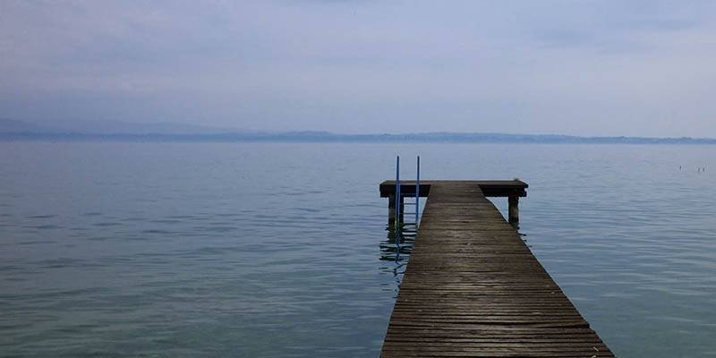
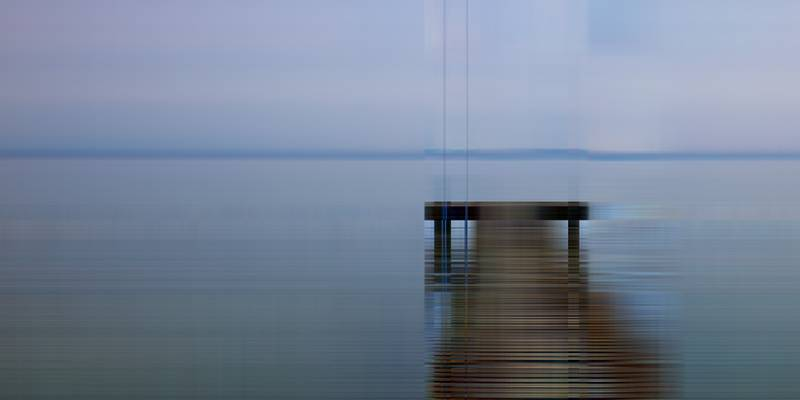

# Image-Compression

R required libraries: jpeg, RCurl

Image compression using PCA and k-means clustering with various values principle components and k. Image sizes for different trails can be found in "results.txt".

   *Original image.*
   

   *Image reduced using PCA with 5 principal components.*
   

   *Image reducded using kmeans clustering with 2 clusters.*
